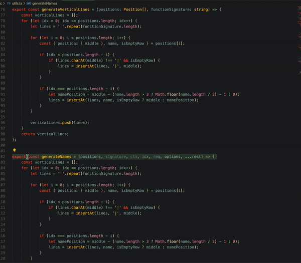

# Ascii doc comments README

## Notice
Still in alpha

"Ascii doc comments" is a Visual Studio Code extension that automatically generates cute ascii diagram comments.
## Features

# Commands
## Ascii doc comments
`Ctrl+Alt+D` and again `Ctrl+Alt+D`
